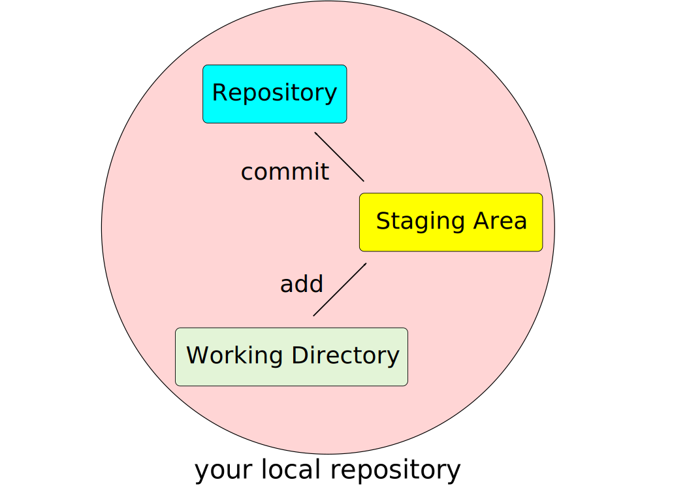
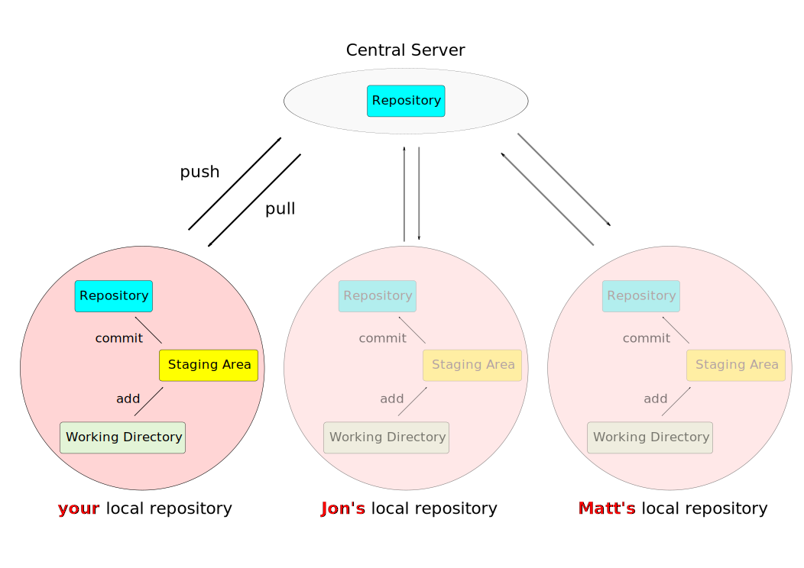

% Version Control with Git
% Holger Dinkel (based on work of Luis Pedro Coelho)

---
output:
revealjs::revealjs_presentation:
theme: league
highlight: pygments
center: true
reveal_options:
    slideNumber: true
    previewLinks: true
    controls: true
    self_contained: true
    reveal_plugins: [“zoom”, “search”, "chalkboard"]
    chalkboard:
      theme: whiteboard
      toggleNotesButton: false
css: git_slides.css 

---

Version Control with Git
========================

Over the next hour, we will introduce you to version control with Git.
Version control is:

1.  A record of what you and your collaborators have done,
2.  A way to see what's changed, and
3.  A way to "blame" people for what they did.

What It Is
==========

-   A way to store and synchronize code (or any files).
-   Documents collections of changes *upon your request*.
-   Keeps your work safe and up-to-date *across machines*!

The important thing is the general concept of version control, but we
are using Git because it has become the standard among open-source
developers, and strong hosting options are available (GitHub, gitlab and
BitBucket).

A common approach...
=====================

- just add something to the name of your file 
  - date
  - comment
  - status change
  - ...

---

{ width=75% }

Basic Version Control
=====================

(from [betterexplained.com](betterexplained.com))

Working together
===============

(from [betterexplained.com](betterexplained.com))

Other problems we can solve
===========================

Imagine multiple copies of important code and data across machines:

-   Which copy has "the fix"
-   Sharing with yourself can be hard, but
-   sharing with others is downright treacherous

What if there's a conflict?

Perfectly reasonable (but actually harder)
==========================================

Cloud storage\
+\
well-considered naming schemes\
=\
Maybe good enough?

How do you manage files now?\
NB: you are still getting work done, right?

Git solves a lot of problems at once
====================================

-   A record of what you and your collaborators have done
-   A way to see what's changed
-   A way to "blame" people for what they did

Two step process
==============

Git repositories
================

Informative commit messages
===========================

{width=55%}\
(from [http://xkcd.com/1296](http://xkcd.com/1296))\
Explain what you're doing, or you won't know later.\
Make a snapshot of your work!

Sharing history
===============

-   The history is a permanent record of what happened (across copies of
    the repository)
-   Put another way: the history is what we copy when we copy a
    repository

History
========

{width=75%}\
(from [git-scm.com/book](git-scm.com/book))

Branching
========

{width=75%}\
(from [git-scm.com/book](git-scm.com/book))

github  / gitlab
===============

- github used to be free, now owned by MS
- pro's / con's
- size limitations
- huge database of source-code -> use the search function

Syllabus
========

1.  Creating repositories
2.  Adding / editing / deleting files
3.  Adding and committing your work
4.  Working with remote repositories
5.  Making "clones"

If time permits:

6.  Looking at history with diff and log
7.  Pushing your work back to a remote
8.  Pulling updates from a remote

